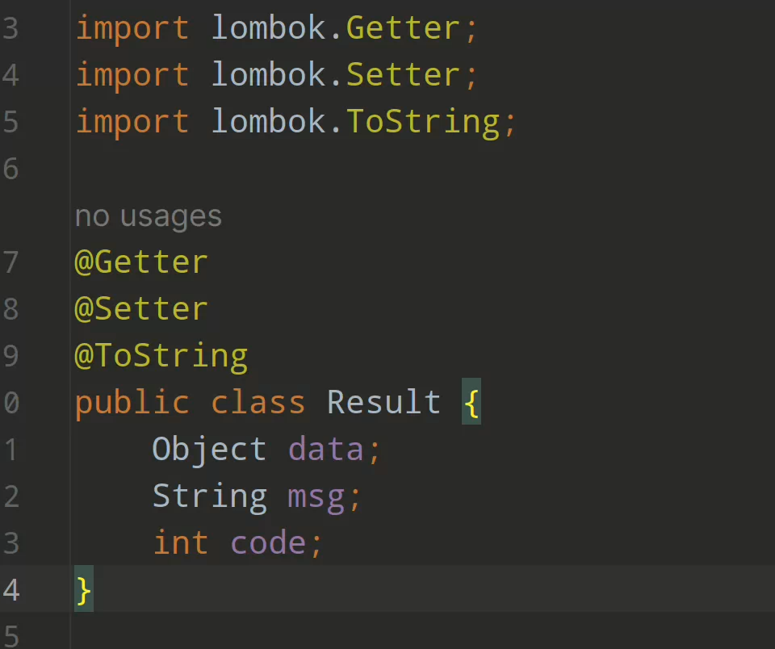
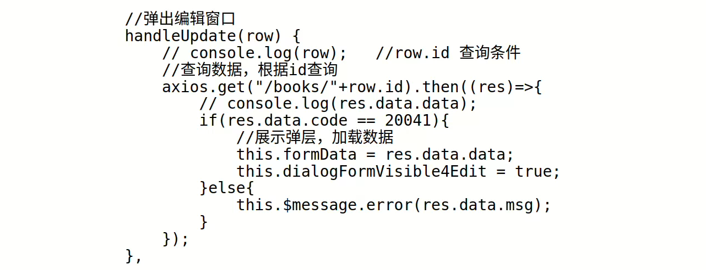

# 写在前面

## Restful风格

​	我们所有开发的接口都是restful风格的接口，对于某一个类的方法接口名字都是一样的，区别在于访问的方法，例如对于 user/{1}, method = GET, 表示获得id == 1的user的信息，同样的user/{1}, method = delete，表示删除id == 1的user信息以此类推。

## 返回格式

​	为了方便前后端的交流我们将传送数据的格式包装成了一个统一的类，其中data字段用来传递数据，code用来传递状态码，message用来传递返回的信息，该类的图片和前端接收数据的示例如下。

# 接口文档

## login接口

### 处理登录请求

接收数据：

id：xxxxx

password：xxxx

接口：/login

方法：post

#### 返回值

##### 成功

data：返回user信息

code: 2000

message：登录成功

##### 失败

data：字符串Error

code: 2001

message：登录失败，账户名或者密码错误

## User相关接口

## 返回所有用户

访问接口：/users

方法：Get

#### 返回值

##### 成功

data: List<Users>

code: 2010

message: 查询全部用户成功

##### 失败

data: Err

code: 2011

message: 查询全部用户失败，请检查网络

### 查询一个用户

接收数据：无

访问接口： /user/{id}（学号）

方法：Get

#### 返回值

##### 成功

data: User

code: 2020

message: 查询成功

##### 失败

data: Err

code: 2021

message: 查询失败，用户不存在

### 更新一个用户

接收数据：User

访问接口：/user/{id}

方法：update

#### 返回值

##### 成功

data：OK

code：2030

message：更新成功

##### 失败

data：Err

code：2031

message：更新失败，请重试

### 删除一个用户

接收数据：无

访问接口：/user/{id}

方法：delete

#### 返回值

##### 成功

data：OK

code：2040

message：删除成功

##### 失败

data：Err

code：2041

message：删除失败，请重试

### 增加一个用户

接收数据：User

访问接口：/user

方法：insert

#### 返回值

##### 成功

data：OK

code：2050

message：增加成功

##### 失败

data：Err

code：2051

message：增加失败，请重试

## Dorm相关接口

## 返回所有寝室

访问接口：/dorms

方法：Get

#### 返回值

##### 成功

data: List<Dorm>

code: 3000

message: 查询全部寝室成功

##### 失败

data: Err

code: 3001

message: 查询全部寝室失败，请检查网络

### 查询一个寝室

接收数据：无

访问接口： /dorm/{id}

方法：Get

#### 返回值

##### 成功

data: Dorm

code: 3010

message: 查询成功

##### 失败

data: Err

code: 3031

message: 查询失败，寝室不存在

### 更新一个寝室

接收数据：Dorm

访问接口：/dorm/{id}

方法：update

#### 返回值

##### 成功

data：OK

code：3030

message：更新成功

##### 失败

data：Err

code：3031

message：更新失败，请重试

### 删除一个寝室

接收数据：无

访问接口：/dorm/{id}

方法：delete

#### 返回值

##### 成功

data：OK

code：3040

message：删除成功

##### 失败

data：Err

code：3041

message：删除失败，请重试

### 增加一个寝室

接收数据：Drom

访问接口：/dorm

方法：insert

#### 返回值

##### 成功

data：OK

code：3050

message：增加成功

##### 失败

data：Err

code：3051

message：增加失败，请重试

### 条件查询寝室1（根据distribution）

接收数据：pageSize，pageNum，distribution

访问接口：/dorm2/{distribution}

方法：GET

#### 返回值

##### 成功

data：List<Dorm>

code：3060

message：查询成功

##### 失败

data：Err

code：3061

message：查询失败，请重试

### 条件查询寝室2（根据building）

接收数据：pageSize，pageNum，building

访问接口：/dorm3/{building}

方法：GET

#### 返回值

##### 成功

data：List<Dorm>

code：3070

message：查询成功

##### 失败

data：Err

code：3071

message：查询失败，请重试

### 条件查询寝室3根据（building， roomNumber）

接收数据：pageSize，pageNum，building， roomNumber

访问接口：/dorm3/{building}/{} roomNumber}

方法：GET

#### 返回值

##### 成功

data：Dorm

code：3080

message：查询成功

##### 失败

data：Err

code：3081

message：查询失败，请重试

## Team接口

## 返回所有组队

访问接口：/teams

方法：Get

#### 返回值

##### 成功

data: List<Team>

code: 4000

message: 查询全部组队成功

##### 失败

data: Err

code: 4001

message: 查询全部组队失败，请重试

### 查询一个组队

接收数据：无

访问接口： /team/{id}

方法：Get

#### 返回值

##### 成功

data: Team

code: 4010

message: 查询成功

##### 失败

data: Err

code: 4011

message: 查询失败，组队不存在

### 更新一个组队

接收数据：Team

访问接口：/Team/{id}

方法：update

#### 返回值

##### 成功

data：OK

code：4030

message：更新成功

##### 失败

data：Err

code：4031

message：更新失败，请重试

### 删除一个组队

接收数据：无

访问接口：/Team/id

方法：delete

#### 返回值

##### 成功

data：OK

code：4040

message：删除成功

##### 失败

data：Err

code：4041

message：删除失败，请重试

### 增加一个组队

接收数据：Team

访问接口：/team

方法：insert

#### 返回值

##### 成功

data：OK

code：4050

message：增加成功

##### 失败

data：Err

code：4051

message：增加失败，请重试

### 将某个成员加入某个组队中

接收：无

访问接口：/{teamID}/{id}

方法：insert

#### 返回值

##### 成功

data：OK

code：4060

message：添加成功

##### 失败

data：Err

code：4061

message：添加失败，请重试

