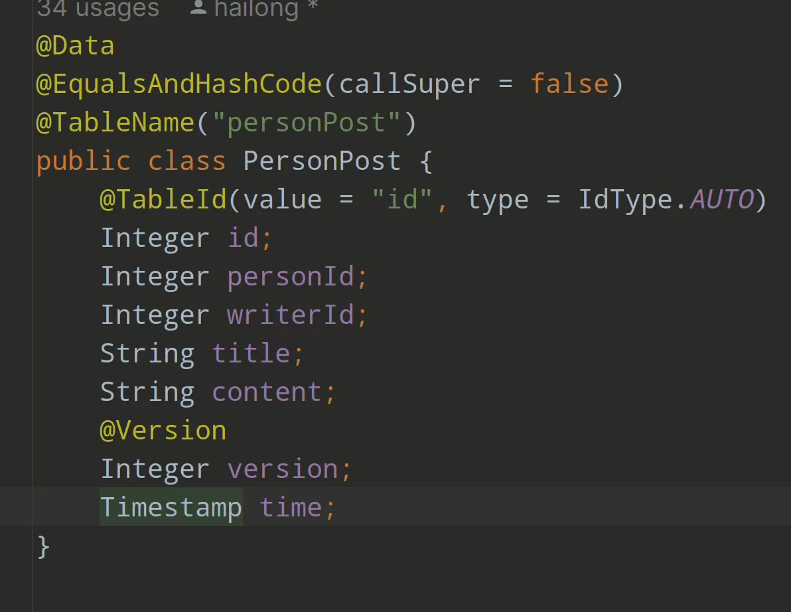
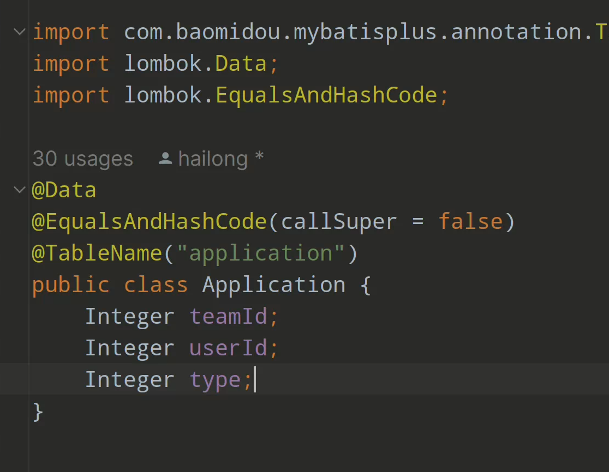

# 写在前面

## Restful风格

​	我们所有开发的接口都是restful风格的接口，对于某一个类的方法接口名字都是一样的，区别在于访问的方法，例如对于 user/{1}, method = GET, 表示获得id == 1的user的信息，同样的user/{1}, method = delete，表示删除id == 1的user信息以此类推。**用{}扩起来的表示路径参数需要通过访问路径传递，但是传的时候不用加上{}**

## 返回格式

​	为了方便前后端的交流我们将传送数据的格式包装成了一个统一的类，其中data字段用来传递数据，code用来传递状态码，message用来传递返回的信息，该类的图片和前端接收数据的示例如下。

所有的状态码

# 接口文档

## login接口Y

### 处理登录请求

接收数据：

id：xxxxx

password：xxxx

接口：admin(或者user)/login

方法：post

#### 返回值

##### 成功

data：返回user信息

code: 2000

message：登录成功

##### 失败

data：Error

code: 2001

message：登录失败，账户名或者密码错误

## User相关接口

## 返回所有用户Y

访问接口：/users

方法：Get

#### 返回值

##### 成功

data: List<Users>

code: 2010

message: 查询全部用户成功

##### 失败

data: Err

code: 2011

message: 查询全部用户失败，请检查网络

### 查询一个用户Y

接收数据：无

访问接口： /user/{id}（学号）

方法：Get

#### 返回值

##### 成功

data: User

code: 2010

message: 查询成功

##### 失败

data: Err

code: 2011

message: 查询失败，用户不存在

### 更新一个用户Y

接收数据：User

（这里之间通过传过来的user的id进行匹配，所以就不用传别的路径参数了）

访问接口：/user

方法：put

#### 返回值

##### 成功

data：OK

code：2020

message：更新成功

##### 失败

data：Err

code：2021

message：更新失败，请重试

### 删除一个用户Y

接收数据：无

访问接口：/user/{id}

方法：delete

#### 返回值

##### 成功

data：OK

code：2030

message：删除成功

##### 失败

data：Err

code：2031

message：删除失败，请重试

### 增加一个用户Y

接收数据：User

访问接口：/user

方法：post

#### 返回值

##### 成功

data：OK

code：2040

message：增加成功

##### 失败

data：Err

code：2041

message：增加失败，请重试

## 查询当前用户组队idY

接收数据：User

访问接口：/user/team/{id}

方法：GET

#### 返回值

##### 成功

data：组队id

code：2010

message：查询成功

##### 失败分两种

data：Err

code：2011

message：用户不存在，请重试

第二种

data：Err

code：2011

message：用户尚未加入组队

# 上传文件

/user/upload

方法：GET

需求：List<User>(JSON Array格式)

## Dorm相关接口

## 返回所有寝室Y

访问接口：/dorms

方法：Get

#### 返回值

##### 成功

data: List<Dorm>

code: 2010

message: 查询全部寝室成功

##### 失败

data: Err

code: 2011

message: 查询全部寝室失败，请检查网络

### 查询一个寝室Y

接收数据：无

访问接口： /dorm/{id}

方法：Get

#### 返回值

##### 成功

data: Dorm

code: 2010

message: 查询成功

##### 失败

data: Err

code: 2011

message: 查询失败，寝室不存在

### 更新一个寝室Y

接收数据：Dorm

访问接口：/dorm

方法：put

#### 返回值

##### 成功

data：OK

code：2020

message：更新成功

##### 失败

data：Err

code：2021

message：更新失败，请重试

### 删除一个寝室Y

接收数据：无

访问接口：/dorm/{id}

方法：delete

#### 返回值

##### 成功

data：OK

code：2030

message：删除成功

##### 失败

data：Err

code：2031

message：删除失败，请重试

### 增加一个寝室Y

接收数据：Drom

访问接口：/dorm

方法：post

#### 返回值

##### 成功

data：OK

code：2040

message：增加成功

##### 失败

data：Err

code：2041

message：增加失败，请重试

### 条件查询寝室1（根据distribution）Y

接收数据：pageSize，pageNum，distribution

访问接口：/dorm2/{distribution}?pageSize=xx&pageNum=xx

方法：GET

#### 返回值

##### 成功

data：List<Dorm>

code：2010

message：查询成功

##### 失败

data：Err

code：2011

message：查询失败，请重试

### 条件查询寝室2（根据building）Y

接收数据：pageSize，pageNum，building

访问接口：/dorm3/{building}?pageSize=xx&pageNum=xx

方法：GET

#### 返回值

##### 成功

data：List<Dorm>

code：2010

message：查询成功

##### 失败

data：Err

code：2011

message：查询失败，请重试

### 条件查询寝室3根据（building， roomNumber）Y

接收数据：pageSize，pageNum，building， roomNumber

访问接口：/dorm3/{building}/{roomNumber}?pageSize=xx&pageNum=xx

方法：GET

#### 返回值

##### 成功

data：Dorm

code：2010

message：查询成功

##### 失败

data：Err

code：2011

message：查询失败，请重试

# 上传文件

/dorm/upload

方法：GET

需求：List<Dorm>(JSON Array格式)

## Team接口

## 返回所有组队

访问接口：/teams

方法：Get

#### 返回值

##### 成功

data: List<Team>

code: 2010

message: 查询全部组队成功

##### 失败

data: Err

code: 2011

message: 查询全部组队失败，请重试

### 通过ID查询一个组队

接收数据：无

访问接口： /team/{id}

方法：Get

#### 返回值

##### 成功

data: Team

code: 2010

message: 查询成功

##### 失败

data: Err

code: 2011

message: 查询失败，组队不存在

### 创建一个组队

接收数据：Team（以json格式传递，只需要headId（也就是队长学号），capacity（容量））

访问接口：/team

方法：post

#### 返回值

##### 成功

data：OK

code：2040

message：增加成功

##### 失败

data：Err

code：2041

message：增加失败，请重试

### 将某个成员加入某个组队中

接收：无

访问接口：/{teamID}/{id}   （前者是队伍id，后者是要添加的学号）

方法：post

#### 返回值

##### 成功

data：OK

code：2040

message：添加成功

##### 失败

data：Err

code：2041

message：添加失败，请重试

### 将某个成员从某个组队中删除

接收：无

访问接口：/{teamID}/{id}   （前者是队伍id，后者是要添加的学号）

方法：delete

#### 返回值

##### 成功

data：OK

code：2030

message：删除成功

##### 失败

data：Err

code：2031

message：删除失败，请重试

### 帖子相关 （目前实现组队帖子和个人帖子）

实现了增删改查（为了方便以后书写，只写接口和需要的输入，结果状态码统一一下放在最上面）

## 对于Teampost

最基础的/teamPost

有post请求新增，需要提供一个完整的teampost（除了version字段和id字段）

有put请求，需要提供一个teampost（必须包含id，其他无所谓只会更改对应id的帖子）

/teamPost/{id}

有delete方法，删除对应id的帖子

/teamPost/team/{id}

Get方法表示获取teamid == id的所有帖子

/teamPosts

Get方法获取所有帖子

## 对于Personpost

最基础的/personPost

有post请求新增，需要提供一个完整的personpost（除了version字段和id字段）

有put请求，需要提供一个personpost（必须包含id，其他无所谓只会更改对应id的帖子，如果没有其他属性表示不更改）

/personPost/{id}

有delete方法，删除对应id的帖子

/personPost/user/{id}

Get方法表示获取personid == id的所有帖子

/personPosts

Get方法获取所有帖子

### 对于点赞帖子

对于这两类分别做了实现但是大体上一样

这两者的接口大致相同

### 点赞personpost/TeamPost

接口`/favouritePersonPost` 或者`/favouriteTeamPost`

方法post，表示新增一个点赞需要提供postid和personid，前者是被点赞的帖子id后者是点赞人

方法delete，删除点赞需要提供postid和personid，前者是被点赞的帖子id后者是点赞人

接口`/favouritePersonPost/post/{id}` 或者`/favouriteTeamPost/post/{id}`

方法get获取某个id帖子的情况

接口`/favouritePersonPost/user/{id}` 或者`/favouriteTeamPost/user/{id}`

方法get获取某个人的点赞情况

## 对于申请部分

有四个接口

/application

post方法，提供application类进行申请

delete方法，提供application类进行删除

/application/team/{id}

根据teamid查询申请，返回申请列表

/application/user/{id}

根据userid查询申请，返回申请项

## DistributionGrade（帖子打分相关）

#### 相关接口

/distributionGrade/{distribution}

方法：GET

需求：路径参数{distribution},返回特定区域的所有评分：**如果返回数组长度为0也会报错**

/distributionGrade

方法：POST

需求：一个DistributionGrade类（JSON），插入一条评分记录

## 个人帖子的评论

### 按照postid查询

/commentPersonPost/post/{id}

方法：GET

需求：路径参数

### 按照personID查询

/commentPersonPost/person/{id}

方法：GET

需求：路径参数

### 添加

/commentPersonPost/

方法：GET

需求：CommentPersonPost（JSON obj）

### 删除

/commentPersonPost/

方法：delete

需求：CommentPersonPost（JSON obj）（仅仅需要个人和帖子id两个参数）

## 团队帖子的评论

### 按照postid查询

/commentTeamPost/post/{id}

方法：GET

需求：路径参数

### 按照personID查询

/commentTeamPost/person/{id}

方法：GET

需求：路径参数

### 添加

/commentTeamPost/

方法：POST

需求：CommentTeamPost（JSON obj）

### 删除

/commentTeamPost/

方法：delete

需求：CommentTeamPost（JSON obj）（仅仅需要个人和帖子id两个参数）

## 收藏帖子相关

### 根据userId查询

/favouriteDorm/user/{id}

方法：GET

需求：路径参数

### 根据dormId查询

/favouriteDorm/dorm/{id}

方法：GET

需求：路径参数

### 根据teamId查询

/favouriteDorm/team/{id}

方法：GET

需求：路径参数

### 添加

/favouriteDorm

方法：POST

需求：FavouriteDorm类（JSON obj）

### 删除

/favouriteDorm

方法：delete

需求：FavouriteDorm类（JSON obj）（仅仅需要个人和寝室两个参数）
